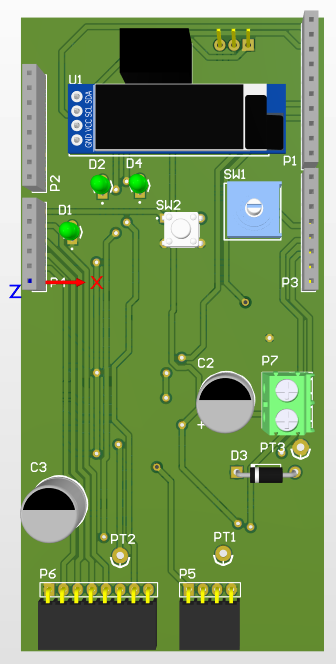
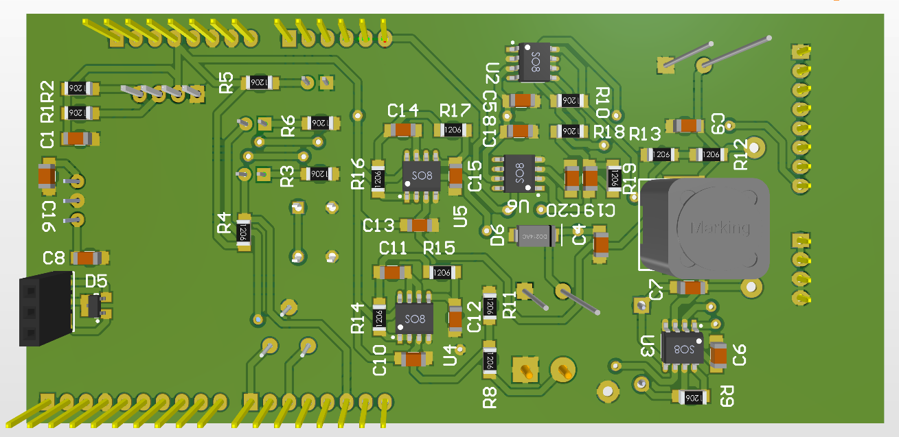
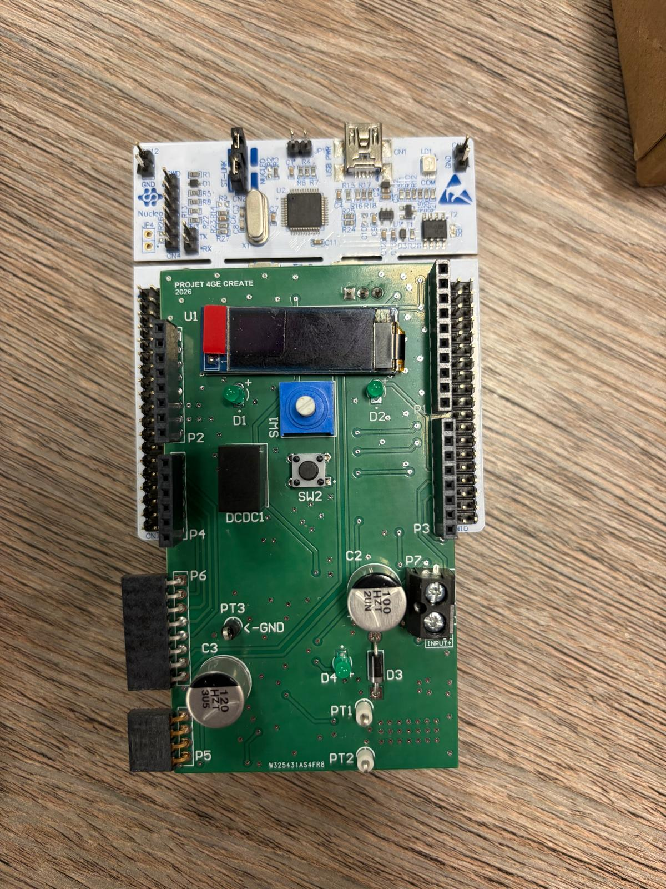
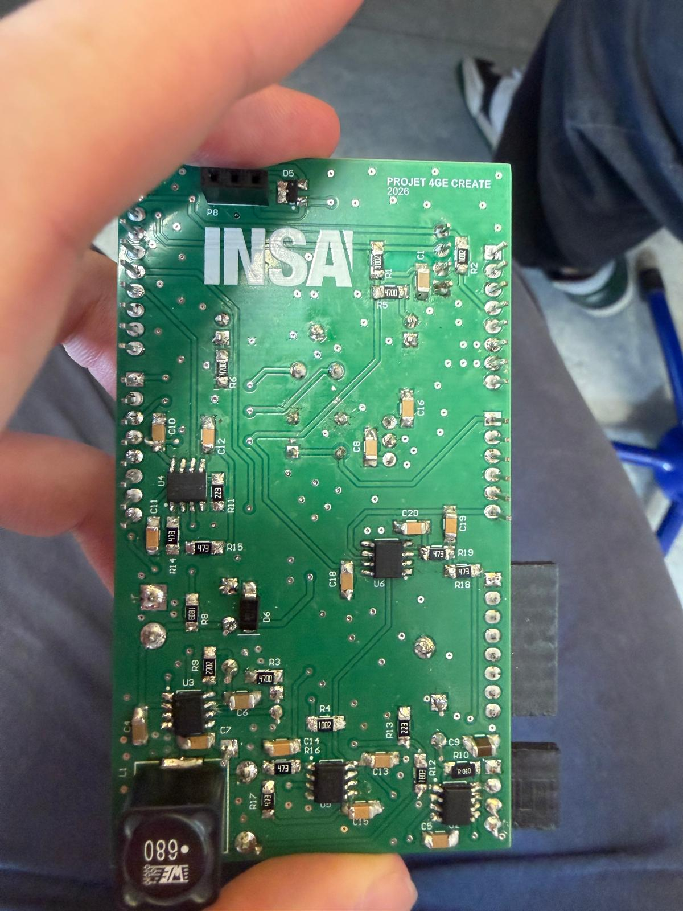

# DC-DC-Power-Converter
Complete design of a DC-DC power converter capable of powering a device using a USB-C cable powered by a DC source while adhering to USB Power Delivery specs
The specifications for the design were split in to two domains:

Static:
- Input Voltage Range = 7.5V - 24V
- Output Voltage Range = 5V - 15V
- Max Output Current = 3A
- Max peak-to-peak variation in the winding less than 25% of the max output current
- Max output voltage variation +/- 25mV

Dynamic:
- Response Time less than 1.5ms (to within 5%) during a step from 5V to 12V (Vin = 24V, Rout = 4Ohms)
- Overshoot: Less than 5% during voltage steps
- Load Step Recovery: Voltage error less than 100mV within 1ms after load transition (Vout=5V, Vin=24V, R[load] passes from 3 kOhms to 4 Ohms)
- Max 2.5V overshoot during a load step (from 3A to 0A)

# Project Components
## Design and size closed loop and open loop Buck Converter using MATLAB Simulink

Using real world RS components available online we sized components to achieve the above specifications with an approximate efficiency of 90% for the open loop design.

The closed loop design incorporated an adjustable PID regulator to respond to a change in load size or target output voltage.

## Mapping and Routing of PCB using Altium Designer

**PCB Top Layer**

**PCB - Bottom Layer**

## Soldering Standardised routing provided by module coordinators

**Board Top Layer**

**Board - Bottom Layer**

## Modifying STM32Cube microcontroller code using C

The project was generated in STM32CubeIDE/CubeMX; our work was confined to the USER CODE sections of main.c. The final stage of the project gave us several different ideas to focus on when adapting the code. Thus it must be acknowledged that this code is an incomplete prototype. Our focuses were User Interface/Controls, PWM Control, Open and Closed Loop modes and Power Delivery Object mode (PI control used for CL and PDO).

The User interface was implemented using an OLED screen, rotary encoder and button. It offers 4 menus: Display of measurements (Vin, Vout, Iout), Control type (OL, CL, PDO), OL setpoint, CL setpoint (set desired output voltage).

- Open Loop - Calculates duty cycle each period using the current input voltage and the user-selected output voltage, with no feedback from the output.
- Closed Loop - Constantly updates the duty cycle using PI in response to fluctuations in the load size to maintain desired voltage output.
- PDO - The controller negotiates the USB-C contract and the firmware reads the agreed profile (5/9/12/15V) and then the PI maintains this level

Direct Memory Access is used for efficient sampling and the PWM output. The ADC by the internal timer and writes its three channels straight to memory. The PWM duty cycle is streamed from a double-buffered array so it can be updated without disturbing the running output. It is 8 bits (0-255) due to the timer's 256-count period.To reduce computational overhead the PI controller coefficents were scaled up in order to avoid floating point values instead completing integer calculations. 

**Notes/Limitations**
- Much of the code's comments are in French as this project was completed during an ERASMUS programme.
- Sections not chosen under the scope: Energy and Power calculations; overload protection; output filtering

# My Contributions
Most tasks were completed collaboratively, the following our sections I contributed to directly.
Simulink - Design and testing of open loop buck converter
Altium - Schematic connections, mapping of PCB layout
PCB - Soldered surface mounted and through-hole components
Microcontroller code (C) - PWM configuration and non-technical writing of User-interface 

# Contributors
Matteo Thenoz
Guillaume Balhi
Gavin Mac Aonghusa

